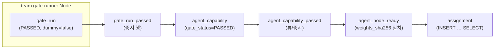

# CapNet 결과보고서 초안 (문의 회신 무관)

**역할:** 공식 양식에 들어가지 않는 **상세·기술 보조 문서**.  
**제출 본문의 정본은** [`contest-report-form-draft.md`](./contest-report-form-draft.md) **「본문 붙여넣기용 압축본」이다.**  
이 문서는 그 뒤를 받치는 근거(아키텍처 도식·불변식·위반 표·재현 절차·라이선스)를 담는다.  
**갱신:** 2026-08-09 (기획서 v4.7 서사 반영)  
**쉬운 안내:** [user-guide-ko.md](../guide/user-guide-ko.md)

과장이 섞이면 1차 서면이 무너진다. **된 것과 안 된 것을 분리한다.**

---

## 0. 한 쪽 요약

**문제:** AI 능력을 호출할 때 세 가지를 알 수 없다 — 무엇이 답했는지, 자격이 있었는지, **내 데이터가 어디까지 갔는지.**

**해법:** 사용자는 능력만 요구한다. Core가 승인된 신뢰 도메인 안의 기기로만 배정하고, 실행 증적을 DB에 남긴다. 라우팅 규칙은 애플리케이션 조건문이 아니라 **PostgreSQL 제약**이다.

**보장한다**
- 승인하지 않은 신뢰 도메인으로 **라우팅되지 않는다** (외래키 강제)
- **사용자는 기기 주소를 모른다.** 기기는 Core가 배정하지 않은 실행을 거부한다 (HTTP 403 실측)
- 누가·무엇으로·언제 실행했는지 **증적이 남고 조회된다**

**보장하지 않는다**
- 기기가 데이터를 남기지 않는다 — 추론은 평문을 요구한다. TEE 없이는 원리적으로 불가
- 두 에이전트가 **같은 답**을 낸다 — 등가는 선택 프로파일의 **관측값**이다 (§8)

**실측:** 위반 6종 DB 거절 · sanity 3종 탈락 · 품질 프로파일 실게이트 acc 0.7000 / f1 0.6982 (`dummy=false`) · 무단 노드 호출 403

**재현:** `docker compose up --build -d` → `scripts/demo.sh` → `sanity.sh` → `demo_violations.sh`.
**`demo.sh` 어디에도 기기 주소가 없다.**

---

## 1. 문제 정의

스토어에 에이전트를 모아 두는 것은 이미 많다. CapNet이 묻는 것은 그 앞이다.

> 내 데이터를 남의 기계에 보내면서, **어디로 갔는지 나중에 답할 수 있는가?**

대부분은 답하지 못한다. 로그에 모델 이름만 남고 그 이름 뒤의 구현은 언제든 바뀔 수 있다 (기획서 §2.5 · §14). 그리고 규정상 원본을 외부로 보낼 수 없는 조직에게는 이게 기능 문제가 아니라 **도입 가능 여부**의 문제다.

정책을 문서에 적어 두는 것으로는 부족하다. 문서는 우회되고 코드의 `if`는 빠뜨려진다. **제약은 거절한다.**

---

## 2. Capability = 인터페이스 계약 (+ 선택 프로파일)

**필수 — 모든 능력의 공통**

| 항목 | 내용 |
|------|------|
| 입출력 스키마 | 무엇을 받고 무엇을 돌려주는가 |
| 전처리 계약 | 게이트와 제품이 동일 (D3) |
| 실행 조건 | `compute_tier` · `trust_domain_min` · 입력 allowlist |

채점 가능성을 요구하지 않는다. 분류·요약·임베딩 어디에도 붙는다.

**선택 — 품질 프로파일**

채점 가능한 능력에는 골든셋 게이트를 덧붙일 수 있다. `image.classify@1`이 첫 사례다.

- closed-set 10라벨 · 64×64 → **32×32** (게이트=제품)
- 통과 = AND: `min_accuracy 0.68` ∧ `min_macro_f1 0.65` ∧ `max_invalid_rate 0.02` ∧ **`min_per_class_recall 0.10`**
- 마지막 항목은 **유도된 값**이다. 균등 10클래스에서 무작위의 클래스별 재현율은 `1/10`이므로, 선언한 모든 라벨에서 무작위보다 나아야 한다. 이 항목이 없으면 **클래스 2개를 통째로 버린 모델이 통과한다** (실측: acc 0.80 · f1 0.711)
- `min_accuracy` 0.68은 **선언된 서비스 수준**이며 측정에서 유도되지 않는다. 허용 구간 (0.447, 0.910]은 실측

사슬은 **Capability → Agent → `weights_sha256`** 만. Model Identifier를 두지 않는다.

---

## 3. 아키텍처

200자 요약: 사용자는 Core하고만 통신한다. Core가 배정하고, Node가 자기 몫을 가져가 실행하고, 결과가 Core를 통해 돌아온다. **판정은 PostgreSQL 제약**이 한다.

### 3.0 실행 사이클

```text
사용자 → Core        능력 요구 (에이전트·기기를 지정하지 않는다)
        Core 워커     신뢰 도메인·등급이 맞고 **살아 있으며 덜 바쁜** 기기로 배정
Node  → Core         자기 배정을 가져가 실행 (outbound. NAT 뒤에서도 동작)
Node  → Core         결과 반환
사용자 → Core        결과·증적 조회
```

두 가지가 이 사이클을 닫는다.

- **당기는 방식.** Core가 Node로 들어가지 않는다. Node가 `GET /v1/internal/nodes/{id}/assignments`로 **자기에게 배정된 것만** 가져간다. 큐를 pull하지 않으므로 "claim은 Core 워커만" 규칙이 유지되고, NAT 뒤 기기도 동작한다.
- **유휴 판정.** 배정 후보는 heartbeat가 신선하고 `AVAILABLE`/`BUSY`인 기기로 제한되며, **진행 중 배정이 적은 기기가 먼저** 선택된다. `DRAINING`·`OFFLINE`·응답 없는 기기는 후보에서 빠지고 작업은 `QUEUED`로 대기했다가 기기가 복구되면 자동으로 흘러간다 (실측).
- **기기 측 검증.** Node는 Core가 배정하지 않은 실행을 **403으로 거부**한다. 이게 없으면 기기에 네트워크로 닿는 누구나 추론을 시킬 수 있다 — 도메인 FK는 `assignment` 기록을 막지만 기기 직접 호출은 막지 못한다.

> **개발 중 이 부분이 지켜지지 않고 있었다.** 클라이언트가 `claim`을 호출하고 기기를 직접 불렀다. 즉 "Core가 중개한다"는 설명과 실제 동작이 달랐다. 발견해서 고쳤고, 그 경위를 여기 남긴다.

### 3.1 구성요소

| 구성 | 역할 | 대회 데모 |
|------|------|-----------|
| **PostgreSQL 16** | 스키마 v4.4 · 제약 · 시드 | compose `postgres` |
| **Core** (FastAPI) | Capability/Agent/Task CRUD · claim · gate-run API | `:8000` |
| **Node** (FastAPI) | 추론 · gate-runner 채점 · Core 등록 | `node-m-team` `:8001` (torch) · `node-s-team` `:8002` · `node-s-public` `:8003` |

Node는 **자기 등급을 주장하지 않는다.** `trust_domain`·`compute_tier_max`는 Core/시드가 부여한다.

### 3.2 게이트 사슬 (M11)

게이트 PASSED가 할당으로 이어지려면 아래 순서를 **건너뛸 수 없다.** 중간 증서가 없으면 FK가 거부한다.



- **(A) 호환 행렬** — `domain_compatible` · `tier_compatible`: 정책상 허용 조합인가
- **(B) 스냅샷 FK** — Task/Capability/Node/Agent **원본 값**과 assignment 스냅샷이 일치하는가
- **(C) 게이트 사슬** — PASSED가 **team gate-runner에서 나온 실측 run**인가 (`gate_run_passed`)

(A)+(B)만으로는 근거 없는 PASSED가 통과할 수 있다. (C)가 M11의 핵심이다.

### 3.3 큐·claim

Task claim은 **Core 워커만** 한다. Node는 큐를 pull하지 않는다. `FOR UPDATE SKIP LOCKED` + 활성 lease 유니크 인덱스로 이중 할당을 DB에서 막는다.

---

## 4. DB로 강제한 불변식

200자 요약: 라우팅 규칙을 앱 `if`가 아니라 **복합 FK·CHECK·호환 행렬**로 옮겼고, 위반 14종을 PostgreSQL 16에서 실측했다.

### 4.1 세 층

| 층 | 메커니즘 | 막는 것 |
|----|----------|---------|
| 정책 | `domain_compatible` · `tier_compatible` (+ rank CHECK) | team→public · L→S 등 **독성 INSERT** |
| 스냅샷 | task/capability/node/agent **복합 FK** | 거짓 tier·domain·capability_id 기재 |
| 게이트 | `gate_run_passed` · `agent_capability_passed` · `ck_ac_run_only_when_passed` | 미통과 Agent 할당 · 비-runner gate_run · 사후 FAILED |

### 4.2 assignment는 INSERT … SELECT만

`assignment` INSERT는 후보를 고를 뿐, 스냅샷 컬럼·FK 판정은 **SELECT가 채운다.** ORM으로 필드를 손으로 넣는 경로는 금지한다 (함정: [`../error/pitfalls.md`](../error/pitfalls.md)).

### 4.3 compute_tier는 앱에서 비교하지 않는다

텍스트 정렬 `L < M < S`는 의도와 **반대**다. v4.4는 `compute_tier_rank` + `tier_compatible` 행렬로 해결했으므로 앱에서 `>=` 비교를 쓰지 않는다.

### 4.4 가중치·READY

`agent_node_ready`는 `agent.weights_sha256`과 **복합 FK**로 묶인다. READY가 있는 동안 가중치 해시를 바꾸거나, 해시 불일치로 READY를 넣으면 FK가 거부한다.

정본 DDL: [`../spec/schema.sql`](../spec/schema.sql) v4.4. 실측 표: [`../error/pg-violations.md`](../error/pg-violations.md).

---

## 5. 위반 실측 (변별점)

원표: [`../error/pg-violations.md`](../error/pg-violations.md) (14종 실측).  
출품 Must M25는 아래 6종을 `scripts/demo_violations.sql`로 재현한다.

| # | 시도 | 기대 |
|---|------|------|
| 1 | 게이트 미통과 Agent 할당 | FK 거부 |
| 2 | team Task → public Node | `domain_compatible` 계열 FK 거부 |
| 3 | L Capability → S Node | `tier_compatible` 계열 FK 거부 |
| 4 | 라이브 lease 중 Node 티어 강등 | FK 거부 |
| 5 | READY 존재 중 가중치 교체 | FK 거부 |
| 6 | PASSED `gate_run` 사후 FAILED | FK 거부 |

앱 `if`가 아니라 **DB가 거절**한다. 제약을 끄거나 `NOT VALID`로 우회하지 않는다.

---

## 6. 골든셋과 채점 규칙

200자 요약: closed-set 10라벨 · 32×32 RGB · AND 임계 · sanity floor 전부 FAILED — 정본 [`../spec/golden/image-classify-v1.md`](../spec/golden/image-classify-v1.md).

### 6.1 데이터·케이스

| 항목 | 데모 (출품) | 본편 (통계) |
|------|-------------|-------------|
| 케이스 수 | **N=40** (클래스당 4장, 모델 기반 선택 **금지**) | n≥300 (`scripts/extract_golden.py --n 300`) |
| 출처 | EuroSAT RGB, Zenodo `7711810`, MIT | 동일 |
| `golden_set_sha256` | `c21d9ef7…` (manifest 핀 · holdout) | 추출 시 재계산 |
| 전처리 | 64×64 JPEG → **32×32** RGB (게이트=제품) | 동일 |

### 6.2 채점 규칙

- **closed-set**: 출력 `label`은 10개 enum 중 하나. 그 외 = invalid.
- **부분 점수 없음** · **유사도 매칭 금지** · `confidence`는 채점에 **미사용**.
- **통과 = AND**: `accuracy ≥ min_accuracy` **∧** `macro_f1 ≥ min_macro_f1` **∧** `invalid_rate ≤ max_invalid_rate`.
- 데모 임계 (실측 보정): **0.68 / 0.65 / 0.02**.
- **Sanity floor 3종**(상수·난수·스키마 위반)이 **전부 FAILED**여야 골든 점수를 신뢰한다. sanity 1종이라도 PASSED면 게이트 주장 불가.

### 6.3 게이트 실행 위치

골든셋 채점은 **team gate-runner Node**(`node-m-team`)에서만 한다. 제출자 Node가 골든셋을 돌리면 정답 하드코딩으로 게이팅이 무력화된다 (D4).

### 6.4 실측 (과장 금지)

| 실행 | accuracy | macro_f1 | invalid | 결과 |
|------|----------|----------|---------|------|
| scratch TinyEuroSAT, N=40, `dummy=false` | 0.7000 | 0.6982 | 0.0000 | **PASSED** |
| sanity 상수·난수·스키마 | — | — | — | **전부 FAILED** |

seed Agent의 dummy `gate_run` PASSED는 **배관용**이며 품질 증명이 아니다.

> **이 표에 붙는 두 한정.** ① 골든셋이 학습셋 안이라 위 점수는 학습 데이터 재현 점수다(§8).
> ② N=40의 표준오차는 약 **0.072**인데 임계(0.68)와의 마진은 **0.020**이다. 마진이 표준오차의 1/3도 안 되므로, 이 합격은 통계적으로 견고하지 않다.

---

## 7. 재현 절차

200자 요약: Docker만 있으면 clone → compose → 네 스크립트로 E2E·실게이트·sanity·M25를 재현한다.

### 7.1 사전 조건

- Docker Desktop (Compose v2)
- 디스크 ~2GB (이미지 + EuroSAT zip은 **별도** ~90MB, 저장소 미동봉)
- Windows: PowerShell 5.1+ · Linux/macOS: bash

### 7.2 명령

```bash
git clone https://github.com/gncorpseo-commits/capnet.git
cd capnet
docker compose up --build -d          # 1–3분: Postgres + Core + Node 3대

# (최초 1회) EuroSAT + scratch 학습 — zip·가중치는 repo에 없음
bash scripts/download_eurosat.sh
bash scripts/train_scratch.sh         # CPU 20–40분
docker compose up --build -d

bash scripts/demo.sh                  # 능력 요구 → 자동 배정 → 실행 → 결과·증적
bash scripts/sanity.sh                # floor 3종 FAILED
bash scripts/demo_violations.sh       # 위반 6종 REJECTED
```

Windows는 동명 `.ps1`.

**`demo.sh` 어디에도 기기 주소가 없다.** 사용자는 `POST /v1/tasks`로 능력을 요구하고 `GET /v1/tasks/{id}`로 결과를 받는다. 배정과 실행은 그 사이에서 자동으로 일어난다.

기기 직접 호출을 시도하면 거부된다.

```bash
curl -X POST http://127.0.0.1:8001/v1/execute -d '{"id":"<남의 배정>",...}'
# {"detail":"assignment not leased to this node (Core가 배정하지 않았다)"}  -> HTTP 403
```

### 7.3 기대 출력

| 스크립트 | 성공 신호 |
|----------|-----------|
| `demo` | `score status=PASSED acc=0.7000` · Task `COMPLETED` · **증적 한 줄**(assignment·node·agent·status) |
| `sanity` | 3 runs **FAILED** |
| `demo_violations` | `NOTICE REJECTED:` ×6 |

시드·해시를 바꾼 뒤에는 `docker compose down -v` 후 재기동.

### 7.4 OpenAPI

`GET http://127.0.0.1:8000/openapi.yaml` — Core v0.3 스펙.

---

## 8. 한계와 다음 단계

**보장하지 않는 것을 먼저 적는다.**

- **기기가 데이터를 남기지 않는다는 보장은 없다.** 추론은 평문을 요구하므로 TEE·동형암호 없이는 원리적으로 불가능하다. 보장하는 것은 **라우팅**(승인 도메인 밖으로 안 나감)과 **증적**(어디로 갔는지 남음)이다. §5.2도 "다운로드 이후 통제 불가 · 토큰 ≠ 면책"으로 인정해 두었다.
- **두 에이전트가 같은 답을 낸다고 말하지 않는다.** 통과 기준이 하한(`acc ≥ t`)이라 통과자 사이의 점수 폭을 구조적으로 제한할 수 없다 — 강제 가능한 상한은 `1 − t`로 항등식이다. 실측 통과자 폭 **0.1767**. 이 사실을 발견한 뒤 등가 보장을 계약에서 내리고 관측값으로 강등했다.

- **기기 등록 API 에 인증이 없다.** 등급(`trust_domain`·`compute_tier_max`)은 Core 가 부여하지만, MVP 는 그 API 를 **팀 내부망 신뢰 경계 안**에 두는 것으로 방어한다. 외부 개방은 자격증명 발급(설계 초안 상태) 이후이며, 그래서 공개 기기는 로드맵상 Phase 4+ 다.

**품질 프로파일(선택 기능)의 알려진 한계**

- **정적·공개 골든셋이라 의도적 과적합을 막을 수 없다.** manifest에 원본 경로가 다 적혀 있다. 해법은 **회전하는 은닉 프로브**이며 다음 단계로 설계해 두었다.
- **선언한 데이터셋 밖의 분포에서는 보장이 성립하지 않는다.** 이 조건부성을 `golden_metrics.guarantee`에 기계가 읽는 형태로 넣었다 — 문서 각주가 아니라 계약의 일부다.
- 개발 중 **골든셋이 학습셋과 겹친 것**을 스스로 발견해 홀드아웃 분할로 고쳤다 (겹침 0/300, `scripts/check_golden_leakage.py`로 검증). 다만 위 두 한계는 정적 골든셋을 쓰는 한 남는다.
- n=300에서 SE≈0.026. 임계 부근 합격은 통계적으로 견고하지 않다.

**다음 단계**

- **유휴 기기 판정** (부하·상태 기반 배정) — 스키마 변경이 필요해 이번 범위 밖이다. 그리고 순서상 사이클이 먼저다: 신뢰할 수 없는 기기를 안전하게 받아들이는 방법을 세우기 전에 공유부터 열면 그것은 공유가 아니라 유출이다
- 회전 은닉 프로브 (기기·에이전트 양쪽에 같은 메커니즘)
- 조직 단위 플릿 → 초청 기기 → 개방형. 각 단계 진입 조건을 판정 기준과 함께 고정해 두었다

---

## 9. 라이선스·데이터·SBOM

200자 요약: 프로젝트 Apache-2.0 · **사전학습 가중치 미사용** · EuroSAT MIT(미동봉) · 의존성은 NOTICE·THIRD-PARTY·sbom.json.

### 9.1 프로젝트·고지

| 항목 | 내용 |
|------|------|
| 출품명 | **CapNet** (Capability Network) |
| 프로젝트 라이선스 | [Apache-2.0](../../LICENSE) |
| 고지 파일 | [NOTICE](../../NOTICE) |
| SBOM | [sbom.json](../../sbom.json) (CycloneDX · `scripts/generate_sbom.ps1`) |
| 서드파티 표 | [THIRD-PARTY-LICENSES.md](../../THIRD-PARTY-LICENSES.md) |

### 9.2 모델 가중치 (2차 검증 대비)

- **사전학습 가중치를 사용하거나 저장소에 동봉하지 않는다.**
- 데모 모델: EuroSAT RGB로 **scratch 학습** (`apps/train/train_scratch.py` → `apps/node/weights/eurosat_scratch.safetensors`).
- 로드 형식: **safetensors만** (`.pt`/pickle 거부).

### 9.3 데이터셋

| 항목 | 값 |
|------|-----|
| 데이터 | EuroSAT **RGB** 배포판 (`EuroSAT_RGB.zip`) |
| Zenodo | record `7711810` · DOI `10.5281/zenodo.7711810` |
| 라이선스 | MIT |
| `archive_sha256` | `b4f5b234ecb7d7ff9c6cddb046543b4717c53fd6e9815be6c0e80cc614f51b90` |
| 저장소 | **원본 미동봉** · `scripts/download_eurosat.ps1` / `.sh` |
| Sentinel | Copernicus Sentinel 공개 데이터 — 이용약관 준수 (NOTICE 인용) |

### 9.4 주요 의존성

| 패키지 | SPDX | 용도 |
|--------|------|------|
| FastAPI | MIT | Core/Node HTTP |
| psycopg | LGPL-3.0 | PostgreSQL |
| safetensors | Apache-2.0 | 가중치 로드 |
| torch / torchvision | BSD-3-Clause | scratch 학습·추론 (node-m-team) |
| PostgreSQL 16 | PostgreSQL | DB |

의존성 추가 시 **같은 커밋**에서 `THIRD-PARTY-LICENSES.md` 한 줄 갱신 (M24).

### 9.5 제출 패키지에 넣지 않는 것

EuroSAT 원본 zip · `.env` · 학습 캐시 · `.git` (Release zip은 `git archive`로 별도 생성).
