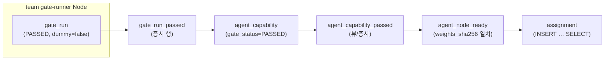

# CapNet 결과보고서 초안 (문의 회신 무관)

**상태:** 초안. 서식 미확정 → 절 단위 블록. 제출본은 이후 pdf/docx.  
**갱신:** 2026-08-06 (§3·§4·§6·§7·§9 추가)  
**쉬운 안내 요지:** [user-guide-ko.md](../guide/user-guide-ko.md)

과장이 섞이면 1차 서면이 무너진다. **된 것과 안 된 것을 분리한다.**

---

## 0. 한 쪽 요약

**문제:** 같은 능력 이름으로 다른 구현이 끼어들어도, 호출자는 알기 어렵다.  
**해법:** Capability를 채점 가능한 계약으로 두고, 게이트·할당 규칙을 PostgreSQL 제약으로 강제한다.  
**증명한 것 (초안 시점):** 스키마 불변식 실측, dummy E2E 배관, 골든셋 데모 N=40 핀, 위반 6종 스크립트, scratch 실게이트 PASSED(acc=0.70, `dummy=false`) + Task 완주, sanity floor FAILED.  
**아직 아닌 것:** 시연 영상(스토리보드만), A/B **통계** 등가 판정(§8), `node_credential` DDL.  
**가장 큰 한정:** **골든셋이 학습셋 안에 있다**(40/40 · 300/300). 아래 게이트 점수는 일반화 성능이 아니라 **학습 데이터 재현 점수**다 (§8 · `scripts/check_golden_leakage.py`).  
**재현:** `docker compose up --build` → `scripts/smoke_w1.ps1`(dummy) → `scripts/demo.ps1`(실게이트) → `scripts/sanity.ps1` → `scripts/demo_violations.ps1`.  
**임계:** 가정 0.75/0.72 → 실측 보정 0.68/0.65. dummy PASSED를 실게이트로 쓰지 않는다.

---

## 1. 문제 정의

스토어에 에이전트를 모아 두는 것은 이미 많다. CapNet이 묻는 것은 그 앞이다.

> 같은 계약을 표방하는 두 Agent를, 사용자가 모르는 채로 바꿔 끼울 수 있는가?

이름만으로는 보장되지 않는다. 별칭·라우터·시간 드리프트는 특정 벤더 공격이 아니라 플랫폼 구조 문제다 (기획서 v4.5 §2.5 · §14).

---

## 2. Capability = 계약

`image.classify@1`은 코드 문자열이 아니라 다음이 묶인 계약이다.

- 입출력 스키마 (closed-set 10라벨)
- 전처리: EuroSAT RGB 원본 64×64 → **32×32** (게이트=제품)
- 골든셋 데모 N=40 + `golden_set_sha256`
- 통과 기준 AND (`min_accuracy` · `min_macro_f1` · `max_invalid_rate`) — **0.68 / 0.65 / 0.02** (실측 보정)

사슬은 **Capability → Agent → weights_sha256** 만. Model Identifier를 두지 않는다.

---

## 3. 아키텍처

200자 요약: Core가 정책·큐·게이트를, Node가 추론·채점을 맡고, **판정은 PostgreSQL 제약**이 한다.

### 3.1 구성요소

| 구성 | 역할 | 대회 데모 |
|------|------|-----------|
| **PostgreSQL 16** | 스키마 v4.4 · 제약 · 시드 | compose `postgres` |
| **Core** (FastAPI) | Capability/Agent/Task CRUD · claim · gate-run API | `:8000` |
| **Node** (FastAPI) | 추론 · gate-runner 채점 · Core 등록 | `node-m-team` `:8001` (torch) · `node-s-team` `:8002` · `node-s-public` `:8003` |

Node는 **자기 등급을 주장하지 않는다.** `trust_domain`·`compute_tier_max`는 Core/시드가 부여한다.

### 3.2 게이트 사슬 (M11)

게이트 PASSED가 할당으로 이어지려면 아래 순서를 **건너뛸 수 없다.** 중간 증서가 없으면 FK가 거부한다.



- **(A) 호환 행렬** — `domain_compatible` · `tier_compatible`: 정책상 허용 조합인가
- **(B) 스냅샷 FK** — Task/Capability/Node/Agent **원본 값**과 assignment 스냅샷이 일치하는가
- **(C) 게이트 사슬** — PASSED가 **team gate-runner에서 나온 실측 run**인가 (`gate_run_passed`)

(A)+(B)만으로는 근거 없는 PASSED가 통과할 수 있다. (C)가 M11의 핵심이다.

### 3.3 큐·claim

Task claim은 **Core 워커만** 한다. Node는 큐를 pull하지 않는다. `FOR UPDATE SKIP LOCKED` + 활성 lease 유니크 인덱스로 이중 할당을 DB에서 막는다.

---

## 4. DB로 강제한 불변식

200자 요약: 라우팅 규칙을 앱 `if`가 아니라 **복합 FK·CHECK·호환 행렬**로 옮겼고, 위반 14종을 PostgreSQL 16에서 실측했다.

### 4.1 세 층

| 층 | 메커니즘 | 막는 것 |
|----|----------|---------|
| 정책 | `domain_compatible` · `tier_compatible` (+ rank CHECK) | team→public · L→S 등 **독성 INSERT** |
| 스냅샷 | task/capability/node/agent **복합 FK** | 거짓 tier·domain·capability_id 기재 |
| 게이트 | `gate_run_passed` · `agent_capability_passed` · `ck_ac_run_only_when_passed` | 미통과 Agent 할당 · 비-runner gate_run · 사후 FAILED |

### 4.2 assignment는 INSERT … SELECT만

`assignment` INSERT는 후보를 고를 뿐, 스냅샷 컬럼·FK 판정은 **SELECT가 채운다.** ORM으로 필드를 손으로 넣는 경로는 금지한다 (함정: [`../error/pitfalls.md`](../error/pitfalls.md)).

### 4.3 compute_tier는 앱에서 비교하지 않는다

텍스트 정렬 `L < M < S`는 의도와 **반대**다. v4.4는 `compute_tier_rank` + `tier_compatible` 행렬로 해결했으므로 앱에서 `>=` 비교를 쓰지 않는다.

### 4.4 가중치·READY

`agent_node_ready`는 `agent.weights_sha256`과 **복합 FK**로 묶인다. READY가 있는 동안 가중치 해시를 바꾸거나, 해시 불일치로 READY를 넣으면 FK가 거부한다.

정본 DDL: [`../spec/schema.sql`](../spec/schema.sql) v4.4. 실측 표: [`../error/pg-violations.md`](../error/pg-violations.md).

---

## 5. 위반 실측 (변별점)

원표: [`../error/pg-violations.md`](../error/pg-violations.md) (14종 실측).  
출품 Must M25는 아래 6종을 `scripts/demo_violations.sql`로 재현한다.

| # | 시도 | 기대 |
|---|------|------|
| 1 | 게이트 미통과 Agent 할당 | FK 거부 |
| 2 | team Task → public Node | `domain_compatible` 계열 FK 거부 |
| 3 | L Capability → S Node | `tier_compatible` 계열 FK 거부 |
| 4 | 라이브 lease 중 Node 티어 강등 | FK 거부 |
| 5 | READY 존재 중 가중치 교체 | FK 거부 |
| 6 | PASSED `gate_run` 사후 FAILED | FK 거부 |

앱 `if`가 아니라 **DB가 거절**한다. 제약을 끄거나 `NOT VALID`로 우회하지 않는다.

---

## 6. 골든셋과 채점 규칙

200자 요약: closed-set 10라벨 · 32×32 RGB · AND 임계 · sanity floor 전부 FAILED — 정본 [`../spec/golden/image-classify-v1.md`](../spec/golden/image-classify-v1.md).

### 6.1 데이터·케이스

| 항목 | 데모 (출품) | 본편 (통계) |
|------|-------------|-------------|
| 케이스 수 | **N=40** (클래스당 4장, 모델 기반 선택 **금지**) | n≥300 (`scripts/extract_golden.py --n 300`) |
| 출처 | EuroSAT RGB, Zenodo `7711810`, MIT | 동일 |
| `golden_set_sha256` | `c8254bcb…` (manifest 핀) | 추출 시 재계산 |
| 전처리 | 64×64 JPEG → **32×32** RGB (게이트=제품) | 동일 |

### 6.2 채점 규칙

- **closed-set**: 출력 `label`은 10개 enum 중 하나. 그 외 = invalid.
- **부분 점수 없음** · **유사도 매칭 금지** · `confidence`는 채점에 **미사용**.
- **통과 = AND**: `accuracy ≥ min_accuracy` **∧** `macro_f1 ≥ min_macro_f1` **∧** `invalid_rate ≤ max_invalid_rate`.
- 데모 임계 (실측 보정): **0.68 / 0.65 / 0.02**.
- **Sanity floor 3종**(상수·난수·스키마 위반)이 **전부 FAILED**여야 골든 점수를 신뢰한다. sanity 1종이라도 PASSED면 게이트 주장 불가.

### 6.3 게이트 실행 위치

골든셋 채점은 **team gate-runner Node**(`node-m-team`)에서만 한다. 제출자 Node가 골든셋을 돌리면 정답 하드코딩으로 게이팅이 무력화된다 (D4).

### 6.4 실측 (과장 금지)

| 실행 | accuracy | macro_f1 | invalid | 결과 |
|------|----------|----------|---------|------|
| scratch TinyEuroSAT, N=40, `dummy=false` | 0.7000 | 0.6982 | 0.0000 | **PASSED** |
| sanity 상수·난수·스키마 | — | — | — | **전부 FAILED** |

seed Agent의 dummy `gate_run` PASSED는 **배관용**이며 품질 증명이 아니다.

> **이 표에 붙는 두 한정.** ① 골든셋이 학습셋 안이라 위 점수는 학습 데이터 재현 점수다(§8).
> ② N=40의 표준오차는 약 **0.072**인데 임계(0.68)와의 마진은 **0.020**이다. 마진이 표준오차의 1/3도 안 되므로, 이 합격은 통계적으로 견고하지 않다.

---

## 7. 재현 절차

200자 요약: Docker만 있으면 clone → compose → 네 스크립트로 E2E·실게이트·sanity·M25를 재현한다.

### 7.1 사전 조건

- Docker Desktop (Compose v2)
- 디스크 ~2GB (이미지 + EuroSAT zip은 **별도** ~90MB, 저장소 미동봉)
- Windows: PowerShell 5.1+ · Linux/macOS: bash

### 7.2 명령 (Windows 기준)

```powershell
git clone https://github.com/gncorpseo-commits/capnet.git
cd capnet
docker compose up --build -d          # 1–3분: Postgres init + Core + Node 3대

# (최초 1회) EuroSAT + scratch 학습 — zip·가중치는 repo에 없음
powershell -ExecutionPolicy Bypass -File scripts/download_eurosat.ps1
powershell -ExecutionPolicy Bypass -File scripts/train_scratch.ps1   # CPU 20–40분
docker compose up --build -d

powershell -ExecutionPolicy Bypass -File scripts/smoke_w1.ps1        # dummy 배관 (~30s)
powershell -ExecutionPolicy Bypass -File scripts/demo.ps1            # 실게이트 + Task (~1–2min)
powershell -ExecutionPolicy Bypass -File scripts/sanity.ps1        # floor FAILED (~30s)
powershell -ExecutionPolicy Bypass -File scripts/demo_violations.ps1 # M25 6종 REJECTED (~20s)
```

Linux/macOS: `.ps1` → 동명 `.sh`. `smoke_w1.ps1` 대신 health + claim 확인.

### 7.3 기대 출력

| 스크립트 | 성공 신호 |
|----------|-----------|
| `smoke_w1` | dummy gate finish OK · placeholder infer |
| `demo` | `score status=PASSED` · `acc≈0.70` · Task `COMPLETED` |
| `sanity` | 3 runs **FAILED** |
| `demo_violations` | `NOTICE REJECTED:` ×6 |

시드·해시를 바꾼 뒤에는 `docker compose down -v` 후 재기동.

### 7.4 OpenAPI

`GET http://127.0.0.1:8000/openapi.yaml` — Core v0.3 스펙.

---

## 8. 한계와 다음 단계

- **골든셋이 학습셋 안에 있다 (홀드아웃 없음).** 데모 N=40 **40/40**, 본편 n=300 **300/300** 케이스가
  학습에 쓰인 이미지다 — `train_scratch.py`가 EuroSAT 27,000장 전수를 학습하고 `extract_golden.py`가
  같은 zip에서 케이스를 뽑기 때문이다 (검증: `python3 scripts/check_golden_leakage.py`).
  따라서 본 보고서의 게이트 점수는 **학습 데이터 재현 점수**이며 일반화 성능이 아니다.
  게이트 사슬·M25·sanity floor는 이 결함의 영향을 받지 않는다 (모델 품질과 무관한 DB 불변식).
  해소 절차는 `docs/ops/phase1-verdict.md` §6.3.
- 데모 N=40이면 대체가능성 통계 판정(편차 0.05)은 **불가** (SE가 임계와 비슷). 본편 n≥300.
- seed Agent의 시드 `gate_run` PASSED는 **배관용**이다. dummy 추론·dummy 게이트를 품질 증명으로 쓰지 않는다.
- A/B(S2)는 **사슬 위에서 실행됐다** (`scripts/proof_ab.sh`, 2026-08-08): Agent A·B가 각각 실게이트 PASSED (acc 0.700 / 0.825, `dummy=false`) 후 동일 case를 `requestedAgentId`로 교차 할당해 둘 다 완료됐다. 다만 **case 1건은 등가성의 통계 근거가 아니다.** n=300 편차 0.0467은 게이트 사슬 밖 오프라인 측정이며 epoch 불일치(A80/B40)·SE≈0.019 한계를 갖는다. **보고서 Must로 올릴지는 master 판단** (SD-001).
- `min_accuracy`/`min_macro_f1`는 TinyEuroSAT scratch N=40 실측 후 **0.68/0.65**로 보정했다 (가정 0.75/0.72는 위였음).
- 공공 유휴·테넌트 제품화는 출품 범위 밖이다.
- `node_credential`은 설계 초안만 (`docs/design/node-credential-draft.md`). DDL·발급 API는 승인 후.

---

## 9. 라이선스·데이터·SBOM

200자 요약: 프로젝트 Apache-2.0 · **사전학습 가중치 미사용** · EuroSAT MIT(미동봉) · 의존성은 NOTICE·THIRD-PARTY·sbom.json.

### 9.1 프로젝트·고지

| 항목 | 내용 |
|------|------|
| 출품명 | **CapNet** (Capability Network) |
| 프로젝트 라이선스 | [Apache-2.0](../../LICENSE) |
| 고지 파일 | [NOTICE](../../NOTICE) |
| SBOM | [sbom.json](../../sbom.json) (CycloneDX · `scripts/generate_sbom.ps1`) |
| 서드파티 표 | [THIRD-PARTY-LICENSES.md](../../THIRD-PARTY-LICENSES.md) |

### 9.2 모델 가중치 (2차 검증 대비)

- **사전학습 가중치를 사용하거나 저장소에 동봉하지 않는다.**
- 데모 모델: EuroSAT RGB로 **scratch 학습** (`apps/train/train_scratch.py` → `apps/node/weights/eurosat_scratch.safetensors`).
- 로드 형식: **safetensors만** (`.pt`/pickle 거부).

### 9.3 데이터셋

| 항목 | 값 |
|------|-----|
| 데이터 | EuroSAT **RGB** 배포판 (`EuroSAT_RGB.zip`) |
| Zenodo | record `7711810` · DOI `10.5281/zenodo.7711810` |
| 라이선스 | MIT |
| `archive_sha256` | `b4f5b234ecb7d7ff9c6cddb046543b4717c53fd6e9815be6c0e80cc614f51b90` |
| 저장소 | **원본 미동봉** · `scripts/download_eurosat.ps1` / `.sh` |
| Sentinel | Copernicus Sentinel 공개 데이터 — 이용약관 준수 (NOTICE 인용) |

### 9.4 주요 의존성

| 패키지 | SPDX | 용도 |
|--------|------|------|
| FastAPI | MIT | Core/Node HTTP |
| psycopg | LGPL-3.0 | PostgreSQL |
| safetensors | Apache-2.0 | 가중치 로드 |
| torch / torchvision | BSD-3-Clause | scratch 학습·추론 (node-m-team) |
| PostgreSQL 16 | PostgreSQL | DB |

의존성 추가 시 **같은 커밋**에서 `THIRD-PARTY-LICENSES.md` 한 줄 갱신 (M24).

### 9.5 제출 패키지에 넣지 않는 것

EuroSAT 원본 zip · `.env` · 학습 캐시 · `.git` (Release zip은 `git archive`로 별도 생성).
