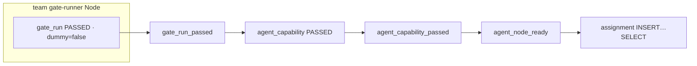

# 게이트 사슬 (영상·양식용 1장)

**용도:** 시연 150–170초 · 결과보고서 아키텍처 칸. A/B 화면 대체.  
**원문:** [`contest-report-draft.md`](./contest-report-draft.md) §3.2

**자막:** PASSED는 team gate-runner 실측 run만 인정. 앱이 등급을 우기지 못한다.  
촬영: Mermaid 미리보기 → PNG 전체 화면 (A/B 화면 없음).
